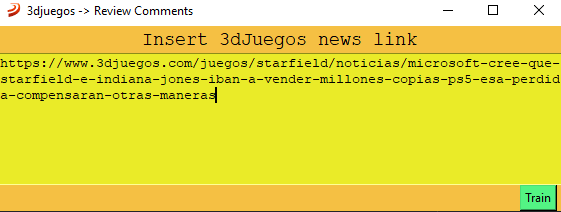
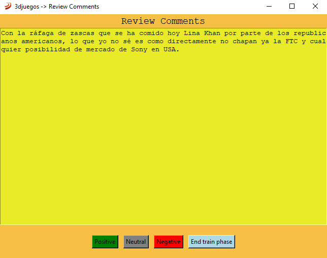
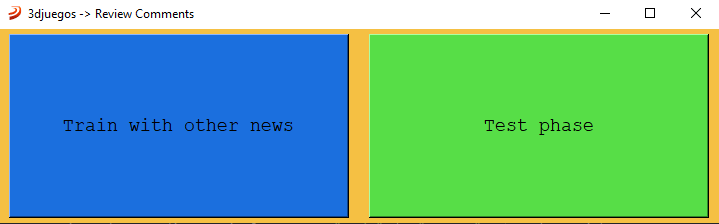
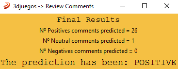

# 3dJuegos-Naive-Bayes-Classifier
Python program that predicts if an article of 3djuegos would have a positive, neutral or negative reception through Naive-Bayes
<a name="readme-top"></a>
<br />
<div align="center">
  <a href="https://github.com/pkq403/3dJuegos-Naive-Bayes-Classifier">
    
  </a>
  <h3 align="center">Naive-Bayes Classifier </h3>
  <h4 align="center"> Has been the reception of the last news positive?</h4>
</div>


<!-- TABLE OF CONTENTS -->
<details>
  <summary>Table of Contents</summary>
  <ol>
    <li>
      <a href="#about-the-project">About The Project</a>
      <ul>
        <li><a href="#built-with">Built With</a></li>
      </ul>
    </li>
    <li>
      <a href="#getting-started">Getting Started</a>
      <ul>
        <li><a href="#prerequisites">Prerequisites</a></li>
        <li><a href="#installation">Installation</a></li>
      </ul>
    </li>
    <li><a href="#usage">Usage</a></li>
    <li><a href="#contact">Contact</a></li>
  </ol>
</details>


<!-- ABOUT THE PROJECT -->
## About The Project
One day, I was visiting this videogame website, and I ask my self how can I know if a news reception has been good, neutral or bad. Time after, I discover Naive-Bayes, and I thought it would be cool to implement it in this website.

Here's why:
* I will learn more about machine learning algorithm implementation
* It is fun to see the predictions
* I will learn about train and test phases

<p align="right">(<a href="#readme-top">back to top</a>)</p>


### Built With

This section should list any major frameworks/libraries used to bootstrap your project. Leave any add-ons/plugins for the acknowledgements section. Here are a few examples.

* Python 3.7.9
* Tkinter
* JSON
* BeautifulSoup
* Requests
* No auxiliary library (pandas, tensorflow...) to do the machine learning stuff 😄
<p align="right">(<a href="#readme-top">back to top</a>)</p>


## Getting Started

### Prerequisites

If u want a quick dependencies installation, do after repo installation.
* pip
  ```sh
  pip install -r requisites.txt
  ```
This are probably the only dependencies u will need.
* Beautiful Soup
  ```sh
  pip install beautifulsoup4
  ```
* Requests
  ```sh
  pip install requests
  ```

### Installation

Just install this repo in your machine!!!

1. Install the required 
2. Clone the repo
   ```sh
   git clone https://github.com/pkq403/3djuegos-Naive-Bayes-Classifier.git
   ```

<p align="right">(<a href="#readme-top">back to top</a>)</p>


<!-- USAGE EXAMPLES -->
## Usage

The initial window asks you to input a 3djuegos news url 



Then you have to review the comments of the news selected with the buttons (positive, negative or neutral), when you think it's enough you can end the training



After that, the program asks u if u want to train with comments of other news, or pass to the test phase.



If you select the test phase option, you will have to input the link to the news you want to test.


Once you input the url, you will seem the prediction results.

<p align="right">(<a href="#readme-top">back to top</a>)</p>


<!-- CONTACT -->
## Contact

Pedro Castro (pkq403) - [@pkq403](https://twitter.com/pkq403) - contactpedrocastro@gmail.com

Project Link: [https://github.com/pkq403/ExtractComments](https://github.com/pkq403/ExtractComments)

<p align="right">(<a href="#readme-top">back to top</a>)</p>
